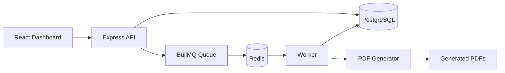

# JobQueue

A distributed job queue system built with React, Node.js, BullMQ, Redis, and PostgreSQL.

The goal of this project is to understand how background processing works in real-world applications. Instead of performing time-consuming tasks directly inside API requests, jobs are pushed to a queue and processed separately by workers.

Currently, the system supports asynchronous PDF generation, job tracking, retry handling, and file downloads through a web dashboard.

---

## Features

* Create jobs from the dashboard
* Process jobs asynchronously using BullMQ
* Redis-backed queue management
* PostgreSQL job persistence
* Automatic retry mechanism for failed jobs
* PDF generation worker using PDFKit
* Download generated PDFs
* Job status tracking
* Dashboard with job statistics
* Result storage for completed jobs

---

## Tech Stack

### Frontend

* React
* Vite
* Tailwind CSS

### Backend

* Node.js
* Express.js

### Queue & Messaging

* BullMQ
* Redis (Upstash)

### Database

* PostgreSQL (Neon)

### File Generation

* PDFKit

### Development Tools

* Docker
* Git
* GitHub

---

## Architecture



---

## How It Works

1. A user creates a job from the dashboard.
2. The API stores the job in PostgreSQL with status `PENDING`.
3. The job is pushed to a BullMQ queue.
4. Redis manages the queued jobs.
5. A worker picks up the job and starts processing.
6. The job status changes to `PROCESSING`.
7. The worker generates the PDF and stores the result.
8. The status is updated to `COMPLETED`.
9. The generated file can be downloaded from the dashboard.

---

## Job Lifecycle

```text
Create Job
    │
    ▼
PENDING
    │
    ▼
PROCESSING
    │
 ┌──┴──┐
 │     │
 ▼     ▼
FAILED COMPLETED
```

---

## Project Structure

```text
JobQueue
│
├── backend
│   ├── config
│   │   ├── db.js
│   │   ├── queue.js
│   │   └── redisConnection.js
│   │
│   ├── generated-pdfs
│   │
│   ├── server.js
│   ├── worker.js
│   ├── index.js
│   └── .env
│
├── frontend
│   └── src
│       ├── pages
│       ├── services
│       └── components
│
└── README.md
```

---

## API Endpoints

### Create Job

```http
POST /jobs
```

Example:

```json
{
  "type": "generate-pdf",
  "payload": {
    "title": "Acknowledgement",
    "content": "Generated using BullMQ and Redis"
  }
}
```

### Get All Jobs

```http
GET /jobs
```

### Get Job By ID

```http
GET /jobs/:id
```

### Download Generated PDF

```http
GET /download/:id
```

---

## Example Response

```json
{
  "id": "b8bc9c5b-f847-449c-af35-f57426e7c527",
  "type": "generate-pdf",
  "status": "COMPLETED",
  "result": {
    "fileName": "b8bc9c5b-f847-449c-af35-f57426e7c527.pdf",
    "filePath": "generated-pdfs/b8bc9c5b-f847-449c-af35-f57426e7c527.pdf"
  }
}
```

---

## Getting Started

### Clone the Repository

```bash
git clone https://github.com/your-username/jobqueue.git
cd jobqueue
```

### Backend Setup

```bash
cd backend
npm install
```

Create a `.env` file:

```env
PORT=5000

DATABASE_URL=your_postgresql_connection_string

REDIS_URL=your_redis_connection_string
```

Start the backend:

```bash
npm run server
```
```bash
node worker.js
```

### Frontend Setup

```bash
cd frontend
npm install
npm run dev
```

---

## Screenshots

Add screenshots of:

* Dashboard
* Job Creation Form
* Job Status Tracking
* PDF Download Feature

---

## Future Improvements

* Email Queue
* Multiple Workers
* Dead Letter Queue (DLQ)
* Job Priorities
* Scheduled Jobs
* Socket.IO Real-Time Updates
* Worker Metrics Dashboard
* Queue Monitoring
* Kubernetes Deployment

---

## Learnings

While building this project, I explored:

* Background job processing
* Queue-based architectures
* Redis and BullMQ
* Worker-based systems
* Retry and failure handling
* PostgreSQL persistence
* Asynchronous task execution

---

## Author

**Adesh Mishra**

LinkedIn: https://www.linkedin.com/in/adesh-mishra-646ba128b/

If you found this project useful, feel free to star the repository.
