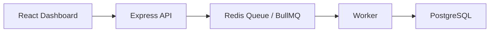

# JobQueue

A distributed job queue dashboard built with **React, Vite, Node.js, BullMQ, PostgreSQL, Redis, and Docker**.

The app lets you create jobs from the browser, watch them flow through a queue, and persist their state in PostgreSQL while workers process tasks in the background.

## What it does

- Create jobs from the dashboard
- Process jobs asynchronously with BullMQ workers
- Store job records in PostgreSQL
- Use Redis as the queue backend
- Show live job counts and recent job history in the UI

## Project Structure

```text
JobQueue/
├── backend/
│   ├── server.js
│   ├── worker.js
│   └── config/
├── frontend/
│   └── src/
│       ├── pages/Dashboard.jsx
│       └── services/api.js
└── README.md
```

## Architecture



## Requirements

- Node.js 18+
- npm
- PostgreSQL running on port `5433`
- Redis running on port `6379`
- Docker if you want to run the database with containers

## Environment

The backend reads these values from `.env` when available:

- `PGHOST`
- `PGPORT`
- `PGDATABASE`
- `PGUSER`
- `PGPASSWORD`
- `PORT`

Default values in the current setup:

- `PGHOST=127.0.0.1`
- `PGPORT=5433`
- `PGDATABASE=jobsdb`
- `PGUSER=admin`
- `PGPASSWORD=admin`
- `PORT=5000`

## Setup

Install dependencies in each app folder:

```bash
cd backend
npm install

cd ../frontend
npm install
```

If you use Docker for PostgreSQL, make sure the container is running before starting the backend.

## Run the app

Start the backend API:

```bash
cd backend
npm run server
```

Start the worker in a separate terminal:

```bash
cd backend
node worker.js
```

Start the frontend:

```bash
cd frontend
npm run dev
```

If Vite reports that port `5173` is busy, it will pick another free port automatically.

## API Endpoints

- `GET /` - health check
- `GET /jobs` - list all jobs
- `GET /jobs/:id` - get a single job
- `POST /jobs` - create a new job

Example request body for `POST /jobs`:

```json
{
  "type": "default",
  "payload": { "message": "hello" }
}
```

## Troubleshooting

- If the dashboard shows blank data, confirm the backend, worker, Redis, and PostgreSQL are all running.
- If you see a CORS error, make sure the frontend is using the same backend host and the backend is restarted after config changes.
- If Vite throws a cache error, delete `frontend/node_modules/.vite` and restart the dev server.

## Notes

- The frontend uses Tailwind CSS v4.
- The queue and worker code are separated so the backend can accept jobs while the worker processes them independently.
